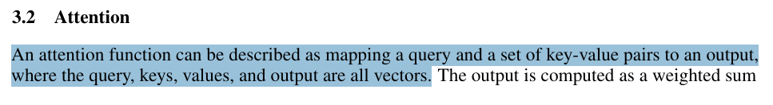
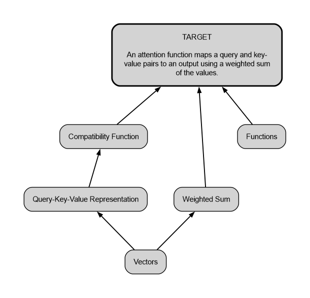

# COMPASS

**Concept Oriented Mapping of Prerequisites for Academic Scientific Sensemaking**

COMPASS is a small RAG-based tool made to help with learning and a frustrating part of reading scientific papers:

> "I understand the words, but what am I actually missing to understand this passage?"

The learner needs to be pro-active in order to remember concepts.

Then, instead of directly explaining a difficult paragraph, COMPASS tries to identify the **prerequisite concepts** needed to understand it, orders them by dependency, and builds a personalized learning map.

The idea is simple: **give the map, not the answer.** 

---

## What it does

The user:

1. uploads a scientific paper as a PDF,
2. describes what they already know in this field,
3. pastes a passage he is trying to understand.

COMPASS then:

- parses the paper and keeps track of its sections;
- locates the target passage;
- retrieves useful context around it;
- searches for semantically related passages in the paper;
- asks an LLM to identify the required prerequisite concepts;
- avoids including concepts already covered by the user's background;
- builds a directed prerequisite map;
- provides search suggestions and a checkpoint question for each concept.

The goal is not to generate a full course, but to help the reader know **what to learn first**.

---

## Example

### Passage selected from the paper



### Generated prerequisite map



This map has been generated for a student knowing only basic Machine Learning.

---

## How it works

The current pipeline is:

```text
PDF
 ↓
PyMuPDF4LLM
 ↓
paragraph + section chunks
 ↓
Sentence Transformers embeddings
 ↓
FAISS index
 ↓
target passage matching
 ↓
hierarchical retrieval
 ├── local context
 ├── same-section context
 └── semantic context
 ↓
LLM structured output
 ↓
prerequisite DAG
 ↓
Graphviz visualization
```

The retrieval combines the natural structure of the paper with semantic similarity.

For each prerequisite, the LLM currently returns:

- the concept name;
- why the concept is needed;
- dependencies on other concepts;
- whether the concept is explicit in the paper or inferred;
- 1 to 3 suggested search queries;
- one checkpoint question in order to make sure the learner understood the concept.


---

## Run locally

Clone the repository:

```bash
git clone https://github.com/LeBengouz/COMPASS.git
cd COMPASS
```

Install the dependencies in your virtual environment:

```bash
python -m pip install -r requirements.txt
```

Create a `.env` file at the root of the project:

```env
OPENAI_API_KEY=[your_api_key_here]
```

Then run:

```bash
streamlit run app.py
```

Graphviz must also be installed on the system for PNG export to work correctly.


---

## Current state

This is still a student project.

The current version already supports:

- only one paper at a time,
- personalized prerequisite generation,
- local retrieval,
- section-level retrieval,
- semantic retrieval,
- structured LLM output,
- prerequisite dependency validation,
- visual learning maps,
- user can explore individual concepts,
- PNG export of the generated map.

---

## What COMPASS is not

It does **not** try to:

- automatically search Google, Google Scholar or others,
- generate a complete course,
- maintain a persistent knowledge graph.


It does **not** for now but maybe later :
- read several papers at once,
- use a multi-agent architecture.

Those features may be interesting later.

---

## Why this project?

Scientific papers often assume a lot of background knowledge. 
When on try catching up with current advanced research papers, it may be hard to know what to start with.

The difficult part is therefore not always:

> "Can someone explain this sentence?"

but rather:

> "What do I need to know before this sentence starts making sense ?"

That's why COMPASS provides users with a **map** !!

Cognitive science, and the learning sciences in particular, demonstrates that learners retain information better when they are **actively engaged in the process** of understanding; activities such as searching for information, drawing on existing knowledge, connecting concepts, or attempting to answer a question contribute more to learning than the passive reading of information.

**COMPASS follows this approach**. The tool allows the learner to carry out the work of research and comprehension while providing guidance throughout the process.
